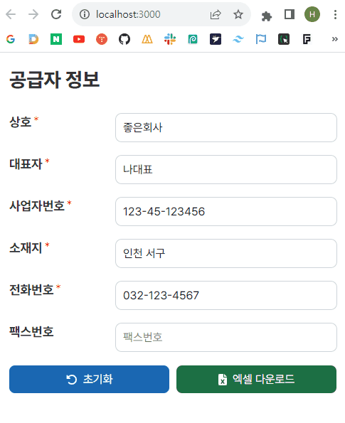

# 📃 Form to Excel

- 거래명세서 폼을 입력하면 엑셀파일로 변환하여 다운로드 받을 수 있는 웹사이트

    

```js
거래명세서 정보 입력
    ↓
서버에 저장된 거래명세서 엑셀파일에 데이터 바인딩
    ↓
서버에서 브라우저로 엑셀파일 전송
    ↓
엑셀파일 자동 다운로드
```

</br>

## 기술 스택

- Frontend: React, TypeScript, react-hook-form
- Backend: Node.js, Express, ExcelJS

</br>

## 개발 진행 단계

- [x] 서버에서 엑셀파일 수정하기
- [x] 서버에서 브라우저로 엑셀파일 전송하기
- [x] 브라우저에서 엑셀파일 다운로드
- [x] 입력 폼 유효성 검증 및 에러 메세지 표시
- [ ] 사업자등록증 유효성 검증, 국세청 API 활용하여 휴/폐업 여부 조회
- [ ] 다음 우편번호 API 활용하여 사업장 소재지 입력받기
- [ ] 사업자번호 하이픈(-) 자동 입력
- [ ] 전화번호, 팩스번호 입력 시 지역번호/휴대폰번호 앞자리 선택
- [ ] 거래품목정보 동적으로 입력받기

</br>

## 개선할 점

- 백엔드 서버를 따로 두지 않고, 프론트에서 외부 서버에 있는 엑셀파일을 읽고 편집해서 다운로드할 수 있는 방법 찾아보기
- 한셀에서 편집한 xlsx 파일은 exceljs에서 인식 못함
